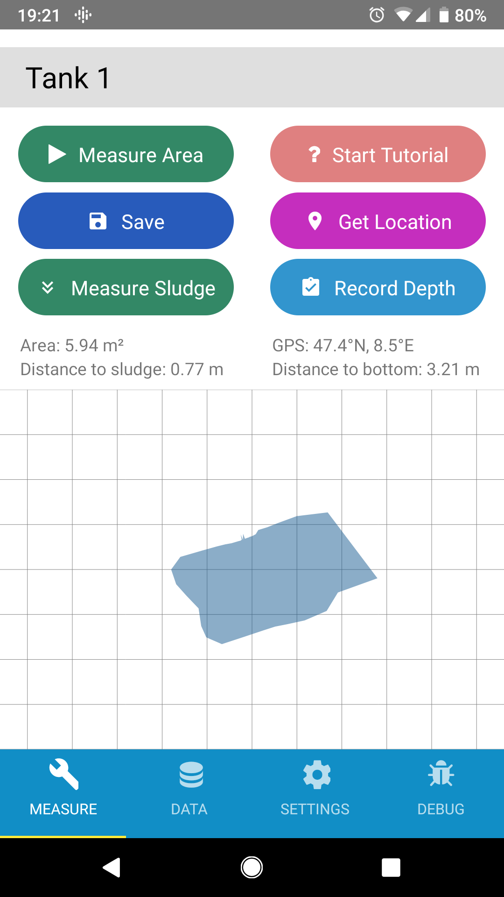

# Volaser

The Volaser app allows you to use your phone to control the EAWAG Volaser, a scanning laser unit which measures containment tank volume. You can download an APK of the most recent version [here](volaser_v0.3.1.apk) or under (Releases)[https://github.com/volaser/volaser-app/releases].

Because the app uses USB Serial to communicate with the laser, there is currently does no support for iOS


## Screenshots


## Build Instructions

To build the app you will need node installed to run npm install to install the dependencies, such as React Native.

```
npm install
```

Then to build for android and push to an attached phone run

```
./gradlew bundleRelease
react-native run-android --variant=release
```
